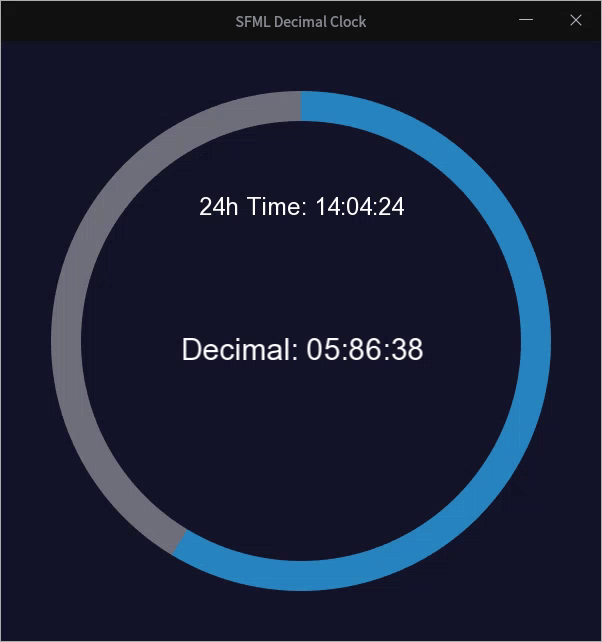

# ⏱️ SFML Decimal Clock
A clock that devides 1 day to 10 hours , 1 hour to 100 minutes and 1 minute to 100 seconds 

A modern desktop application built with the Simple and Fast Multimedia Library (SFML) that simultaneously displays both Standard Time and Decimal Time using a visually appealing interface.

🌟 Core Functionality: Decimal Time System
This clock implements a unique Decimal Time System where the day is divided into 10 hours, each hour into 100 minutes, and each minute into 100 seconds.

Decimal Time Units:
1 Day = 10 Decimal Hours
1 Decimal Hour = 100 Decimal Minutes
1 Decimal Minute = 100 Decimal Seconds
The application displays the current time in both formats side-by-side for comparison.

Decimal Time Equivalents (vs. Standard Time)

A Decimal Hour is equivalent to 2 hours and 24 minutes of standard time.

A Decimal Minute is equivalent to 86.4 standard seconds.

A Decimal Second is equivalent to 0.864 standard seconds.

✨ Modern Visuals: Glassmorphism Implementation
The user interface is designed to offer a contemporary look by leveraging the Glassmorphism style:

Window Size: Increased display area to 600x600 pixels with 8x Anti-aliasing for smoother rendering.
Frosted Glass Effect: Achieved using transparent/semi-opaque colored arcs to represent the progress of the day in both time systems.
Centralized Text: The decimal time display is precisely centered on the screen for clear visibility.
🛠️ Technologies Used
Programming Language: C++
Graphics Library: SFML (Simple and Fast Multimedia Library)
Timing: std::chrono for precise time calculation.
⚙️ Build and Run Instructions
To successfully compile and run this project, ensure the following prerequisites are met:

C++ Compiler: (e.g., GCC/G++ or Clang)
SFML Library: Make sure the SFML libraries are correctly installed and linked for your environment.
Compilation Command (using G++):

content_copy
bash
g++ decimal_clock.cpp -o decimal_clock -lsfml-graphics -lsfml-window -lsfml-system
Execution Notes:

For the program to run without errors, ensure the required assets are in the same directory as the executable (decimal_clock):
Font File: arial.ttf
Icon File: icon.png
